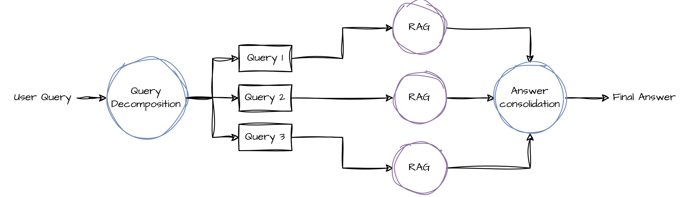
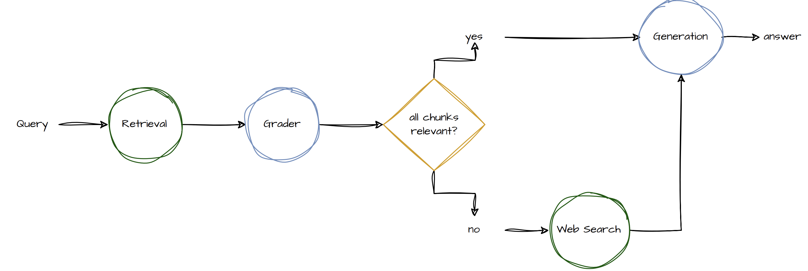
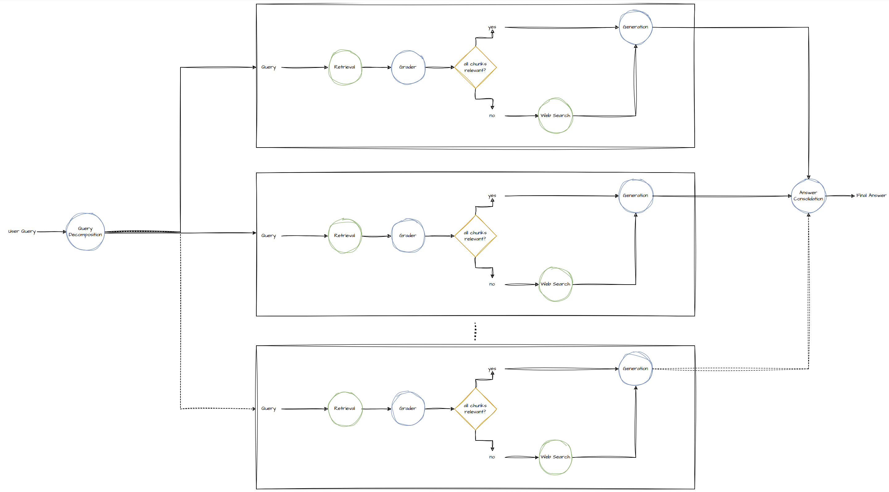
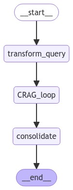
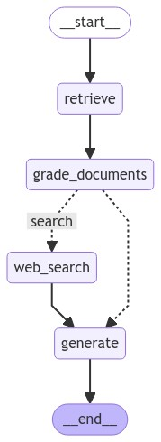

<!-- Improved compatibility of back to top link: See: https://github.com/othneildrew/Best-README-Template/pull/73 -->
<a id="readme-top"></a>
<!--
*** Thanks for checking out the Best-README-Template. If you have a suggestion
*** that would make this better, please fork the repo and create a pull request
*** or simply open an issue with the tag "enhancement".
*** Don't forget to give the project a star!
*** Thanks again! Now go create something AMAZING! :D
-->


<!-- PROJECT SHIELDS -->
<!--
*** I'm using markdown "reference style" links for readability.
*** Reference links are enclosed in brackets [ ] instead of parentheses ( ).
*** See the bottom of this document for the declaration of the reference variables
*** for contributors-url, forks-url, etc. This is an optional, concise syntax you may use.
*** https://www.markdownguide.org/basic-syntax/#reference-style-links
-->
[![LinkedIn][linkedin-shield]][linkedin-url]


<!-- PROJECT LOGO -->
<br />
<div align="center">
  <!-- <a href="https://github.ibm.com/Dean-Sacoransky/agenticai">
    
  </a> -->

  <h3 align="center">watsonx LangGraph Agent</h3>

  <p align="center">
    Handle Complex Multistep questions with compound AI
    <br />
  </p>
</div>


<!-- TABLE OF CONTENTS -->
<details>
  <summary>Table of Contents</summary>
  <ol>
    <li>
      <a href="#about-the-project">About The Project</a>
    </li>
    <li>
      <a href="#getting-started">Getting Started</a>
      <ul>
        <li><a href="#installation">Installation</a></li>
      </ul>
    </li>
    <li><a href="#contact">Contact</a></li>
  </ol>
</details>


<!-- ABOUT THE PROJECT -->
## About The Project

A RAG agent built to handle complex, multi-hop questions through query decomposition, self-reflection / self-grading on retrieved documents (CRAG), tool use to interface with the internet, and answer consolidation. 

### Query Decomposition


### [Corrective-RAG (CRAG)](https://arxiv.org/abs/2401.15884) 


### Combined Architecture


### LangGraph
We will implement this agent as a custom / user-defined control flow in LangGraph, as illustrated in the two graphs below




### Tools / Externals
We'll use [Tavily](https://python.langchain.com/v0.2/docs/integrations/tools/tavily_search/) for web search.

We'll use an elasticsearch vectorstore with watsonx slate embeddings

<p align="right">(<a href="#readme-top">back to top</a>)</p>


<!-- ### Built With

* [![Next][Next.js]][Next-url]
* [![React][React.js]][React-url]
* [![Vue][Vue.js]][Vue-url]
* [![Angular][Angular.io]][Angular-url]
* [![Svelte][Svelte.dev]][Svelte-url]
* [![Laravel][Laravel.com]][Laravel-url]
* [![Bootstrap][Bootstrap.com]][Bootstrap-url]
* [![JQuery][JQuery.com]][JQuery-url] --> -->

<!-- <p align="right">(<a href="#readme-top">back to top</a>)</p>


<!-- GETTING STARTED -->
## Getting Started

### Installation

1. Get API Keys for Watsonx.ai, Tavily, and elasticsearch
2. Clone the repo
   ```bash
   git clone https://github.ibm.com/Dean-Sacoransky/agenticai.git
   ```
3. Create virtual environment

    ```bash
    python3 -m venv venv
    ```

    Activate virtual environment

    ```bash
    source venv/bin/activate
    ```

    Install dependencies
    ```bash
    python3 -m pip install -r requirements.txt
    ```

4. Enter your API keys in .env file 
   ```python
    #openai:
    `OPENAI_API_KEY`  = 'ENTER YOUR API'
    #Tavily:
    `TAVILY_API_KEY` = 'ENTER YOUR API'
   ```
5. Run Application
    ```bash
    python3 my_agent/agent.py
    ```
6. Open browser, and navigate to http://127.0.0.1:5000/
<p align="right">(<a href="#readme-top">back to top</a>)</p>

6. Run as Notebook
- Run rag-agent.ipynb in notebooks directory using the venv python virtual environment as kernel.


<!-- CONTACT -->
## Contact

Dean Sacoransky - [@linkedin](https://www.linkedin.com/in/dean-sacoransky-6a671119a/) - dean.sacoransky@ibm.com


<!-- MARKDOWN LINKS & IMAGES -->
<!-- https://www.markdownguide.org/basic-syntax/#reference-style-links -->
[contributors-shield]: https://img.shields.io/github/contributors/othneildrew/Best-README-Template.svg?style=for-the-badge
[contributors-url]: https://github.com/othneildrew/Best-README-Template/graphs/contributors
[forks-shield]: https://img.shields.io/github/forks/othneildrew/Best-README-Template.svg?style=for-the-badge
[forks-url]: https://github.com/othneildrew/Best-README-Template/network/members
[stars-shield]: https://img.shields.io/github/stars/othneildrew/Best-README-Template.svg?style=for-the-badge
[stars-url]: https://github.com/othneildrew/Best-README-Template/stargazers
[issues-shield]: https://img.shields.io/github/issues/othneildrew/Best-README-Template.svg?style=for-the-badge
[issues-url]: https://github.com/othneildrew/Best-README-Template/issues
[license-shield]: https://img.shields.io/github/license/othneildrew/Best-README-Template.svg?style=for-the-badge
[license-url]: https://github.com/othneildrew/Best-README-Template/blob/master/LICENSE.txt
[linkedin-shield]: https://img.shields.io/badge/-LinkedIn-black.svg?style=for-the-badge&logo=linkedin&colorB=555
[linkedin-url]: https://www.linkedin.com/in/dean-sacoransky-6a671119a/
[product-screenshot]: images/screenshot.png
[Next.js]: https://img.shields.io/badge/next.js-000000?style=for-the-badge&logo=nextdotjs&logoColor=white
